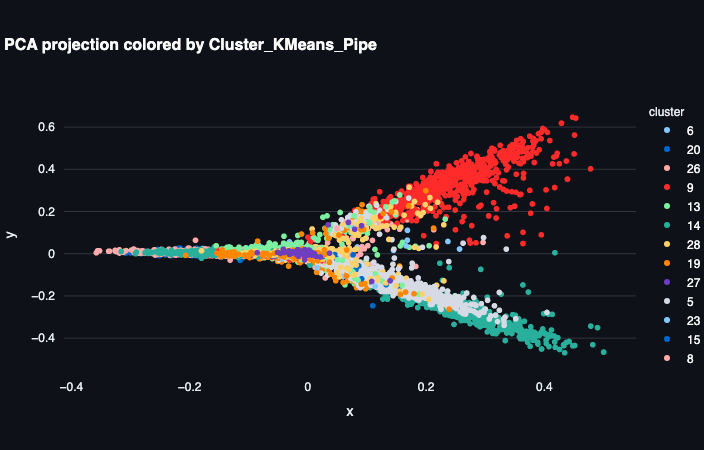
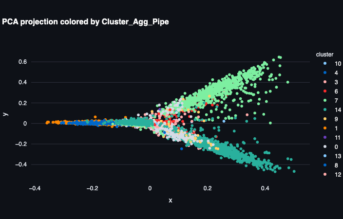
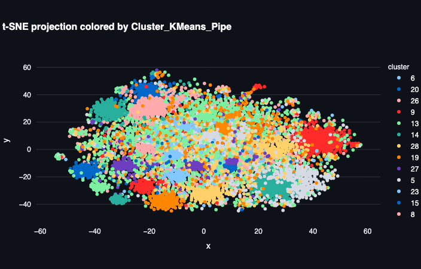
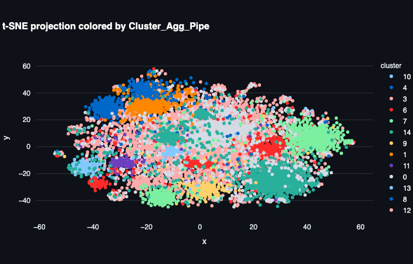
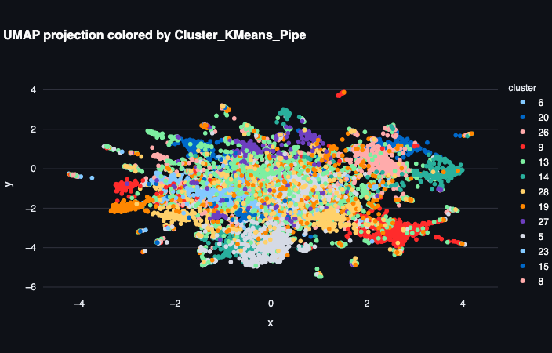
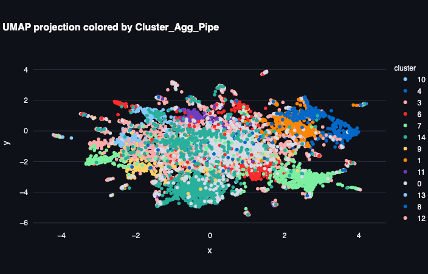
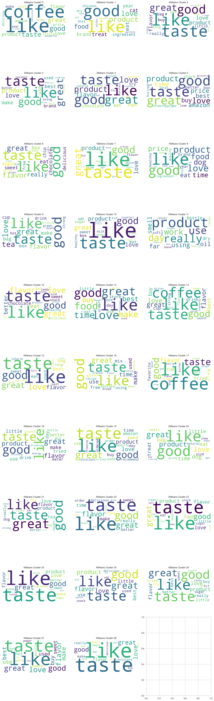
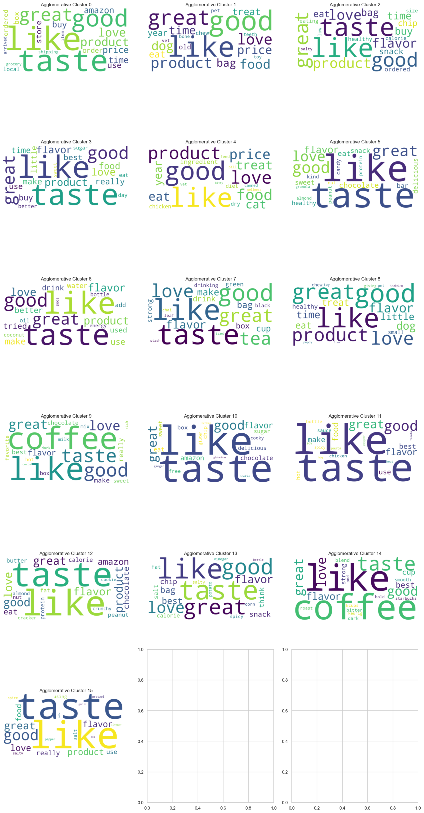

# Amazon Fine-food Reviews NLP Clustering, Unsupervised Learning, and Visualization

This project analyzes Amazon Fine-food reviews using Natural Language Processing (NLP), unsupervised clustering, and interactive visualizations. The goal is to uncover patterns and insights from the reviews without relying on labeled data.

## Dataset

The dataset is available from [Kaggle](https://www.kaggle.com/datasets/snap/amazon-fine-food-reviews). It contains reviews of fine foods from Amazon, including text reviews and ratings. Key columns include: Id, ProductId, UserId, ProfileName, HelpfulnessNumerator, HelpfulnessDenominator, Score, Time, Summary, and Text.

### Automated Download

You can download and extract the dataset automatically using the provided script:

```bash
python dataset_download.py
```
This will save the files in the `data/` directory.

## Installation

Before running the analysis, install the required Python packages:

```bash
pip install -r requirements.txt
```

If you use conda, you can also set up the environment with:

```bash
conda env create -f conda-env.yml
conda activate amazon-fine-food-reviews-nlp-clustering
```

## Highlights  
- **Two Clustering Flavors**  
  - **KMeans Pipeline**: Highly granular topics (e.g. peanut-butter fans, green-tea drinkers) tuned via silhouette-based GridSearch.  
  - **Agglomerative Pipeline**: Broader, hierarchy-inspired themes (e.g. savory snacks, pet treats) that group related topics.  
- **Dimensionality Reduction Comparisons**  
  - **PCA**: Captures overall “positive ↔ negative” and “short ↔ detailed” review sweeps.  
  - **t-SNE**: Pulls out tight local clusters—perfect to spot niche subtopics.  
  - **UMAP**: Balances local vs. global structure, showing both topic islands and their relationships.  
- **Word Clouds**  
  Instantly see each cluster’s defining vocabulary: “coffee,” “cup,” “flavor” versus “dog,” “treat,” “chew.”  
- **Interactive Explorer**  
  Spin up a Streamlit dashboard in seconds to zoom, hover and filter all clusters live.

## What’s Inside  
- **Data**: Raw reviews + scores, preprocessed and tokenized.  
- **Notebooks**: Step-by-step EDA, clustering, evaluation (silhouette, Davies-Bouldin), and visualizations.  
- **Plots**: PCA, t-SNE, UMAP outputs in `plots/`—quick glance at cluster structure.  
- **Word Clouds**: Top-20 TF-IDF words per cluster, saved as `plots/word-cloud-*.png`.  
- **Streamlit App**: Run `streamlit run streamlit_app.py` to explore embeddings, switch between algorithms, and read review snippets.

## Workflow Overview

1. **Data Preprocessing**: Reviews are cleaned and tokenized using a custom `WordTokenizer` class (see `main.ipynb`). Steps include lowercasing, stop word removal, punctuation stripping, lemmatization, HTML decoding, contraction expansion, and tokenization.
2. **TF-IDF Vectorization**: Text is converted to TF-IDF vectors for clustering.
3. **Clustering**: Both KMeans and Agglomerative (hierarchical) clustering are applied. Hyperparameters are tuned using GridSearchCV and dimensionality reduction (TruncatedSVD).
4. **Evaluation**: Clustering quality is measured using Silhouette Score, Davies-Bouldin Index, and Adjusted Rand Index.
5. **Visualization**: Results are visualized using PCA, t-SNE, and UMAP. Plots are saved in the `plots/` directory:
   - `pca-kmeans-pipe.png`, `pca-agg-pipe.png`
   - `tsne-kmeans-pipe.png`, `tsne-agg-pipe.png`
   - `umap-kmeans-pipe.png`, `umap-agg-pipe.png`
6. **Cluster Analysis**: Top words per cluster are extracted and visualized with word clouds.
7. **Interactive Dashboard**: Explore clusters interactively using Streamlit:

   ```bash
   streamlit run streamlit_app.py
   ```

## Outputs

- Preprocessed and clustered data: `data/fine_food_reviews_with_clusters_and_scores.csv`
- Tokenized reviews: `data/fine_food_reviews_tokenized.csv`
- Cluster visualizations: see `plots/`

## Visualization Examples

Below are sample cluster visualizations generated during analysis. These images are located in the `plots/` folder:

### PCA

**KMeans Clusters:**



**Agglomerative Clusters:**



### t-SNE

**KMeans Clusters:**



**Agglomerative Clusters:**



### UMAP

**KMeans Clusters:**



**Agglomerative Clusters:**



### Word Clouds

**KMeans Clusters:**



**Agglomerative Clusters:**



## Notebooks

All analysis steps are documented in `main.ipynb`.

## License

See `LICENSE` for details.

